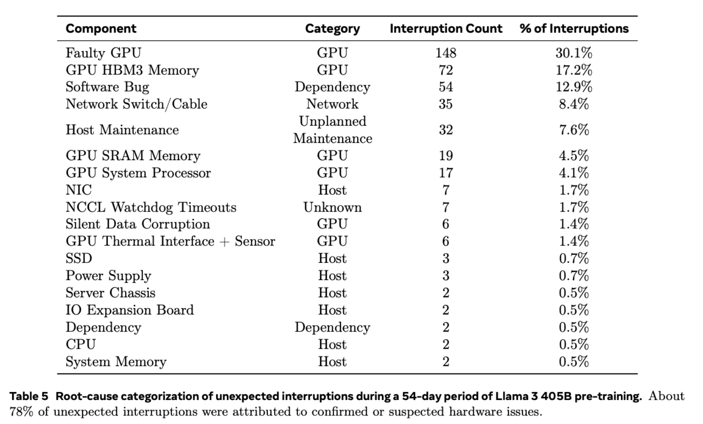
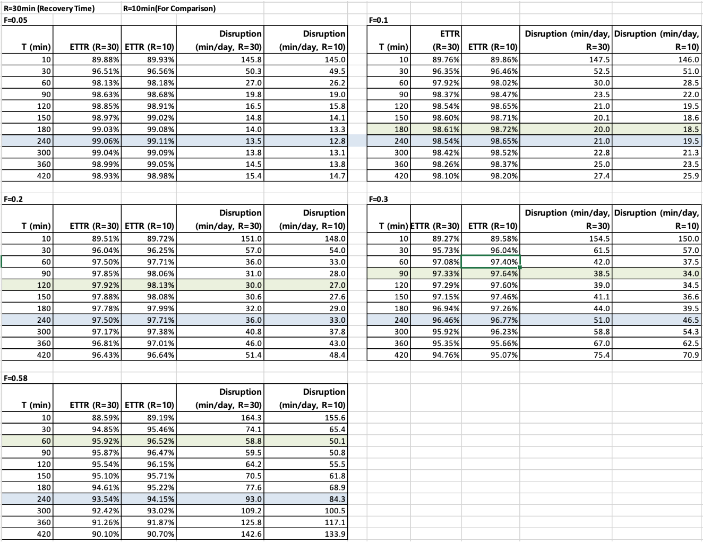

# EC2 GPU Cluster Reliability and Recovery Configuration for Self Managed ML

## **1.  AWS ParallelCluster+Slurm+ Capacity Block = Recovery from EC2 node failures**

* If Capacity is reserved with **Capacity Block** or targeted On-Deman-Capacity-Reservation, **the number of availabe GPU instances are maintained to be the reserved number**. When a GPU node or instance failure happens in a CB UltraCluster, CB replenishes a new instance. 
* **ParallelCluster terminates the faulty node and launch the new node.**
* **Slurm submits a job on the replaced node.** 
* This recovery procedure usually takes around 30 mins. 
* **Alternatively, EKS supports automatic recovery but requires skillful k8s engineers.** 

## 2. Instance-Level SLA  https://aws.amazon.com/compute/sla/

For each individual Amazon EC2 instance (“Single EC2 Instance”), AWS will use commercially reasonable efforts to make the Single EC2 Instance **available** with an **Instance-Level Uptime Percentage of at least 99.5%**, in each case during any monthly billing cycle (the “Instance-Level SLA”). In the event any Single EC2 Instance does not meet the Instance-Level SLA, you will be eligible to receive a Service Credit as described below.

“**Unavailability**” means: For the Instance-Level **SLA**, your Single EC2 Instance has **no external connectivity.**

|**Instance-Level Uptime Percentage**|**Service Credit Percentage**	|
|---	|---	|
|Less than 99.5% but equal to or greater than 99.0%	|10%	|
|Less than 99.0% but equal to or greater than 95.0%	|30%	|
|Less than 95.0%	|100%	|

### Amazon Compute SLA Exclusions

Instance-Level SLA, respectively, do not apply to any unavailability, suspension or termination of Amazon EC2, or any other Amazon EC2performance issues, directly or indirectly: (i) caused by factors outside of our reasonable control, including any force majeure event or Internet access or related problems beyond the demarcation point of Amazon EC2; (ii) **that result from any actions or inactions of you, including failure to acknowledge a recovery volume or respond to resource health concerns;** (iii) that result from your equipment, software or other technology; or (iv) arising from our suspension or termination of your right to use the applicable Amazon EC2 in accordance with the Agreement.

When the average recovery time (MTTR, minutes) per failure (= Unavailability) is determined, the relationship between the daily average failure rate (F, failures/day) and the Instance-Level Uptime % is as follows.

### Relationship with 99.5% SLA (Instance-Level)

* AWS defines instance availability as "the ratio of minutes of Unavailability (no external connectivity) in a month".
* On a daily basis,

Uptime(%)≈100×(1−1440F×MTTR)

    * F = Daily average failure rate (failures/day)
    * MTTR = Average time (minutes) counted as Unavailability per failure
    * 1440 = Minutes per day
* The AWS EC2 Instance-Level SLA is 99.5% or higher per month. This means that "the ratio of Unavailability in a month is ≤ 0.5%".
* Converted to a daily average, the average allowable Unavailability per day is 7.2 minutes (= 1440 × 0.005).

Therefore, to meet 99.5%:

Daily failure count F vs. MTTR (min)

    * If MTTR=60 minutes, F ≤ 0.12 failures/day
    * If MTTR=30 minutes, F ≤ 0.24 failures/day 
    * If MTTR=10 minutes, F ≤ 0.72 failures/day
    * If MTTR=5 minutes, F ≤ 1.44 failures/day

If F=0.5 failures/day, MTTR=10 minutes
==>Uptime = 100 × (1 - 0.5 × 10/1440) ≈ 99.653% → SLA met

GPU instance failure rates meet the Instance SLA for example if  less than 0.12 failures/day for MTTR=60min or less than  0.24 failures/day for MTTR=30min. Actual GPU Instance failure rates are much better than this

* The **'failure' counted in SLA** is "**minutes when the instance's external connectivity is completely lost**", and does not include all training disruption time until the instance is reconnected, software is installed, and training is fully prepared.

When the Recovery Time to resume training is assumed to be 30 minutes, the actual Unavailability Time when all external connections are lost is less than that. Unavailability Time does not include the downtime until the instance is reconnected, software is installed, and training is fully prepared. 

Thus, **Recovery Time > Unavailability Time in SLA.**

## 3. GPU Failure Rates based on publically available data

**Target Cluster Configuration**

* **Target Workload: Distributed training of 500B-level Model**
* **128x p5en.48xlarge** **instances(=1024 H200 GPUs) on a single spine or UltraCluster**.
* Framework: **Megatron-LM, pyxis/enroot container**
* **Target write time(Checkpoint save time)** **≤ 60 s** (hard cap **90 s**) to **FSx for Lustre**.

**From Meta’s publicly available failure rate data** ( [arXiv](https://arxiv.org/html/2410.21680v1)1 , [arXiv](https://arxiv.org/pdf/2407.21783)2) of  the Llama-3 405B 16k H100 cluster (2000 nodes, 1 node=8xH100), we can estimate the daily failure rate for the target 128-node cluster (H200 is assumed to be 20% higher than the measured H100) as a worst case scenario.

Daily Failure Rate Estimate for 128x P5en.48xlarge nodes (1024 H200)

|Category	|Raw Node Failure Rate  (failures / node-day)	|Daily Failures for 128-node (1024 GPU) Cluster (failures / 128-node-day)	|MTTF(Mean Time To First Failure)	|근거	|
|---	|---	|---	|---	|---	|
|A100 (RSC-1, Meta measured)	|0.0065	|0.83 failures/day	|29 h	|[arXiv](https://arxiv.org/html/2410.21680v1)1 (Meta)	|
|H100 (Meta easured)	|0.0038	|0.49 failures/day	|49 h	|[arXiv](https://arxiv.org/pdf/2407.21783)2 The Llama 3 Herd of Models. 3.3.4 Reliability and Operational Challenges (Meta)	|
|**H200**(H100 × 1.2 conservative)	|0.0045	|0.58 failures/day	|**42 h**	|H100 measured × 1.2	|

As a worst-case assumption, the 1024 H200 GPU (128 node) cluster is expected to have an average of 0.58 failures per day, with one node going down every 42 hours. Since the Meta data is from a year ago when H100 was first released, the actual data point may be improved at the current time.

The main **causes of failures** in Meta’ logs are as follows.

## 4. Maximizing Resource Utilization for 128x P5en.48xlarge

The **failure rate F** below refers to the average **daily failure count for the 128-instance (1024xH200) cluster**.

Let Cluster utilization be defined by **ETTR (Effective Training Time Ratio): The ratio of the actual training time to the total time the CB instance is allocated.**

**ETTR = 1 - (Planned  pause (S/T) + Expected failure loss (F × (T/2 + R)/1440))**

T (Checkpoint interval, minutes): 240(4 hours)
S (Checkpoint Save time, minutes): 1
R (Recovery time, minutes) — Slurm re-launch: 30
F (Failures per day per 128-instance)
1440= minutes/day= 60x24

If the Failures of the cluster per day are low:

* **If the daily 128-node failure count is very low (<0.1)**, setting the c**heckpoint save time to around 4 hours is close to optimal.**
* **Improvements in Recovery Time have little impact on the daily Disruption time.**
* Improving Recovery time from 30 to 10 minutes only improves the average daily training disruption by about 40-90 seconds.

**If the Failures per day are higher, optimization of the checkpoint save interval and Recovery time is necessary.**

* **If the daily 128-node failure count is high (>0.5)**, setting **the checkpoint save interval to 1 hour is close to optimal.**
* **Changing the checkpoint save interval from 4 hours to 1 hour improves** the disruption time by **39 minutes.**
* **Improving Recovery time from 30 to 10 minutes improves the daily training disruption by about 9 minutes.**

The table below calculates the daily training time ratio (ETTR) and average daily Disruption time, assuming Recovery Times of 30 minutes and 10 minutes. The green rows indicate the optimal checkpoint save interval.

## 5. To Use or Not to Use a Spare Node? 

### Comparison of Resource Utilization for 128-node (1 node = 8x H200) with and without Spares

* **Below 128-node day failures of 0.4, having no spares is more advantageous, and the utilization difference is marginal even at a failure rate of 0.5.**
* Comparing the case of 
    * 30-minute Recovery time without spare nodes (128-node) and
    * Using a warm spare (127 active + 1 spare node) with Recovery times of 5 and 2 minutes:
* No spares (all 128 running): 30 minutes of downtime per failure
    * ETTR = 1 - S/T - F(T/2 + R)/1440
    * T (checkpoint interval, minutes), S = 1 minute
    * Daily failure rate F (failures/day), Recovery time R = 30 minutes (no spares)
* Warm spare (127+1): Normally 127/128 (=0.9921875) runs, let’s assume 5 or 2 minutes of downtime during replacement respectively.
    * ETTR = 127/128 × (S/T - F(T/2 + R)/1440)
    * Here R = 5 minutes or 2 minutes (warm spare)

For Checkpoint interval of 4 hours, T = 240 minutes, Failure rates vs ETTR Utilization

|F (fail/day)	|No spare (30min recovey)	|Warm Spare 127+1(5 min recovery)	|Warm Spare 127+1(2min recovery)	|
|---	|---	|---	|---	|
|0.05	|**99.06%**	|98.38%	|98.39%	|
|0.1	|**98.54%**	|97.94%	|97.97%	|
|0.2	|**97.50%**	|97.08%	|97.12%	|
|0.3	|**96.46%**	|96.22%	|96.28%	|
|0.5	|94.38%	|**94.50%**	|**94.60%**	|

For Checkpoint interval of 1 hour, T = 60 minutes,  Failure rates vs ETTR Utilization

|F (fail/day)	|No spare (30min recovey)	|Warm Spare 127+1(5 min recovery)	|Warm Spare 127+1(2min recovery)	|
|---	|---	|---	|---	|
|0.05	|**98.13%**	|97.45%	|97.46%	|
|0.1	|**97.92%**	|97.32%	|97.35%	|
|0.2	|**97.50%**	|97.08%	|97.12%	|
|0.3	|**97.08%**	|96.84%	|96.90%	|
|0.5	|96.25%	|**96.36%**	|**96.46%**	|

* **If F ≈ 0.431 failures/day or less, having no spares is more advantageous** (warm spare Recovery time of 5 minutes), and the difference is negligible even at F=0.5.
* **If F ≈ 0.387 failures/day or less, having no spares is more advantageous** (warm spare Recovery time of 2 minutes), and the difference is negligible even at F=0.5.

